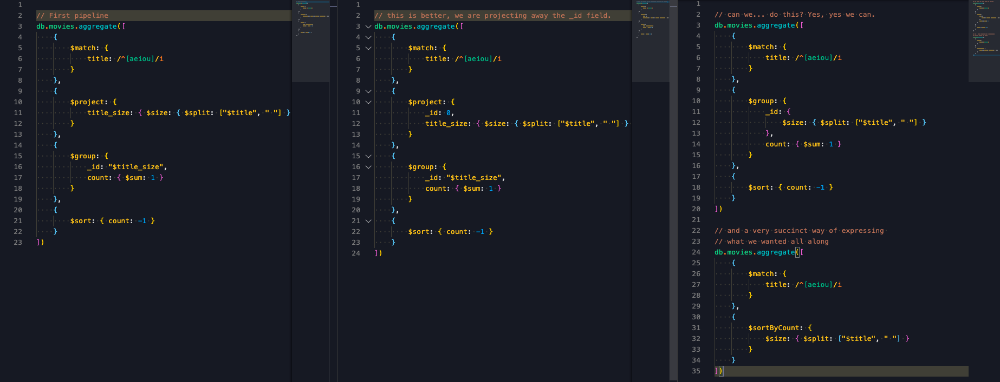
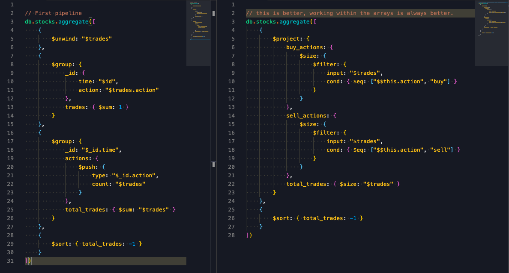

# M121 - The MongoDB Aggregation Framework

## Aggregations syntax {docsify-ignore}
[Quick reference][quickReference]
[Variables][variables]

```js
db.collection.aggregate([{ Stage1 }, { Stage2 }, { Stage3 }, ...], { Options })
```


## Basic Aggregation

### $match
- A $match stage may contain a $text query operator, but it must be the first stage in a pipeline
- $match should come early in an aggregation pipeline
- You cannot use $where with $match
- $match uses the same query syntax as find

### $project
- Once we specify one field to retain, we must specify all fields we want to retain. The _id field is the only exception to this
- Beyond simply removing and retaining fields, $project lets us add new fields
- $project can be used as many times as required within an Aggregation pipeline
- $project can be used to reassign values to existing field names and to derive entirely new fields

Example
```js
// If we'd like to analyze our collection to find movie titles that are composed of only one word
db.movies.aggregate([
    {
        $project: {
           count: {$size: { $split: ["$title", ' '] }},
           _id: 0
        }
    }, {
        $match: {
            count: {$lte: 1}
        }
    }
]).itcount()
```

### $geoNear
[More info here][geoNear]

- $geoNear must be the first stage in an aggregation pipeline
- The collection can have one and only one 2dsphere index
- If using 2dsphere, the distance is returned in meters. If using legacy coordinates, the distance is returned in radians

### $sort
- $sort can take advantage of indexes if used early within a pipeline
- By default, $sort will only use up to 100 megabytes of RAM. Setting `{ allowDiskUse: true }` will allow for larger sorts

Example
```js
/**
Calculate an average rating for each movie in our collection where English is an available language, the minimum imdb.rating is at least 1, the minimum imdb.votes is at least 1, and it was released in 1990 or after. You'll be required to rescale (or normalize) imdb.votes. The formula to rescale imdb.votes and calculate normalized_rating is included as a handout.
*/
db.movies.aggregate([
  {
    $match: {
      year: { $gte: 1990 },
      languages: { $in: ["English"] },
      "imdb.votes": { $gte: 1 },
      "imdb.rating": { $gte: 1 }
    }
  },
  {
    $project: {
      _id: 0,
      title: 1,
      "imdb.rating": 1,
      "imdb.votes": 1,
      normalized_rating: {
        $avg: [
          "$imdb.rating",
          {
            $add: [
              1,
              {
                $multiply: [
                  9,
                  {
                    $divide: [
                      { $subtract: ["$imdb.votes", 5] },
                      { $subtract: [1521105, 5] }
                    ]
                  }
                ]
              }
            ]
          }
        ]
      }
    }
  },
  { $sort: { normalized_rating: 1 } },
  { $limit: 1 }
])
```


## Core Aggregation

### $group
[More info here][group]

- _id is where to specify what incoming documents should be grouped on
- Can use all accumulator expressions within $group
- $group can be used multiple times within a pipeline
- It may be necessary to sanitize incoming data

### $unwind
[More info here][unwind]

- $unwind only works on array values
- Using unwind on large collections with big documents may lead to performance issues. Setting `{ allowDiskUse: true }`

### $lookup
[More info here][lookup]

Syntax:
```js
{
   $lookup:
     {
       from: "<collection to join>",
       localField: "<field from the input documents>",
       foreignField: "<field from the documents of the 'from' collection>",
       as: "<output array field>"
     }
}
```

- The **from** collection cannot be sharded, and must be in the same database
- The values in **localField** and **foreignField** are matched on equality
- **as** can be any name, but if it exists in the working document that field will be overwritten

Example
```js
// Which alliance from air_alliances flies the most routes with either a Boeing 747 or an Airbus A380 (abbreviated 747 and 380 in air_routes)?
db.air_routes.aggregate([{
    $match: {
        airplane: {$in: ["747", "380"]}
    }
}, {
    $lookup: {
        from: "air_alliances",
        localField: "airline.name",
        foreignField: "airlines",
        as: "routes"
    }
}, {
    $unwind: "$routes"
},
{
    $group: {
        _id: "$routes.name",
        count: {$sum: 1}
    }
}])
```

### $graphLookup
[More info here][graphLookup]

Syntax:
```js
{
   $graphLookup: {
      from: "<collection>",
      startWith: "<expression>",
      connectFromField: "<string>",
      connectToField: "<string>",
      as: "<string>",
      maxDepth: "<number>",
      depthField: "<string>",
      restrictSearchWithMatch: "<document>"
   }
}
```

- The $graphLookup stage must stay within the 100 MiB memory limit. If `{ allowDiskUse: true }` is specified for the aggregate() operation, the $graphLookup stage ignores the option
- Not allow in sharding collections

### $sortByCount
[More info here][sortByCount]
Groups incoming documents based on the value of a specified expression, then computes the count of documents in each distinct group.

- Is equivalent to a group stage to count occurence, and then sorting in descending order

### $bucket
[More info here][bucket]

Categorizes incoming documents into groups, called buckets, based on a specified expression and bucket boundaries and outputs a document per each bucket.

Syntax
```js
{
  $bucket: {
      groupBy: "<expression>",
      boundaries: [ "<lowerbound1>", "<lowerbound2>", "..." ],
      default: "<literal>",
      output: {
         "<output1>": { "<$accumulator expression>" },
         "..."
         "<outputN>": { "<$accumulator expression>" }
      }
   }
}
```

- Must always specify at least 2 values to **boundaries**
- **boundaries** must all be of the same general type (Numeric, String)
- **count** is inserted by default with no output, but removed when output is specified

### $bucketAuto
[More info here][bucketAuto]

Categorizes incoming documents into a specific number of groups, called buckets, based on a specified expression. Bucket boundaries are automatically determined in an attempt to evenly distribute the documents into the specified number of buckets.

Syntax
```js
{
  $bucketAuto: {
      groupBy: "<expression>",
      buckets: "number",
      output: {
         "<output1>": { "<$accumulator expression>" },
         "..."
         "<outputN>": { "<$accumulator expression>" }
      },
      granularity: "<string>"
   }
}
```

- Cardinality of **groupBy** expression may impact even distribution and number of buckets
- Specifying a **granularity** requires the expression to **groupBy** to resolve to a numeric value

### $facet
[More info here][facet]

Processes multiple aggregation pipelines within a single stage on the same set of input documents. Each sub-pipeline has its own field in the output document where its results are stored as an array of documents.

Example
```js
/**
How many movies are in both the top ten highest rated movies according to the imdb.rating and the metacritic fields? We should get these results with exactly one access to the database.

What is the intersection?
*/
db.movies.aggregate([
  {
    $match: {
      metacritic: { $gte: 0 },
      "imdb.rating": { $gte: 0 }
    }
  },
  {
    $project: {
      _id: 0,
      metacritic: 1,
      imdb: 1,
      title: 1
    }
  },
  {
    $facet: {
      top_metacritic: [
        {
          $sort: {
            metacritic: -1,
            title: 1
          }
        },
        {
          $limit: 10
        },
        {
          $project: {
            title: 1
          }
        }
      ],
      top_imdb: [
        {
          $sort: {
            "imdb.rating": -1,
            title: 1
          }
        },
        {
          $limit: 10
        },
        {
          $project: {
            title: 1
          }
        }
      ]
    }
  },
  {
    $project: {
      movies_in_both: {
        $setIntersection: ["$top_metacritic", "$top_imdb"]
      }
    }
  }
])
```


### $redact
[More info here][redact]

Restricts the contents of the documents based on information stored in the documents themselves.

- **$$KEEP** and **$$PRUNE** automatically apply to all levels below the evaluated level
- **$$DESCEND** retains the current level and evaluates the next level down
- **$redact** is not for restricting access to a collection


### $out
[More info here][out]

Takes the documents returned by the aggregation pipeline and writes them to a specified collection.

- The **$out** operator must be the last stage in the pipeline.
- Will create a new collection or overwrite an existing collection if specified
- Honors indexes on existing collections
- Will not create or overwrite data if pipeline errors
- Creates collections in the same database as the source collection


### $merge
[More info here][merge]

Writes the results of the aggregation pipeline to a specified collection.

Syntax
```js
{ $merge: {
     into: "<collection> -or- { db: <db>, coll: <collection> }",
     on: "<identifier field> -or- [ <identifier field1>, ...]",  // Optional
     let: "<variables>",                                         // Optional
     whenMatched: "<replace|keepExisting|merge|fail|pipeline>",  // Optional
     whenNotMatched: "<insert|discard|fail>"                     // Optional
} }
```

- The **$merge** operator must be the last stage in the pipeline.
- Can output to a collection in the same or different database.
- Creates a new collection if the output collection does not already exist.
- Can incorporate results into an existing collection.
- Can output to a sharded collection. Input collection can also be sharded.


## Views
[More info here][views]

- MongoDB does not persist the view contents to disk
- Views are read-only. Write operations to views will error.
- You cannot rename views
- Views are computed on demand during read operations, and MongoDB executes read operations on views as part of the underlying aggregation pipeline.
- View definitions are public for any role
- Avoid referring to sensitive fields within the pipeline that defines a view
- Views have some restrictions.
- Horizontal slicing is performed with the $match stage, reducing the number of documents that are returned.
- Vertical slicing is performed with a $project or other shaping stage, modifying individual documents.

Example
```js
db.createView("bronze_banking", "customers", [
  {
    "$match": { "accountType": "bronze" }
  },
  {
    "$project": {
      "_id": 0,
      "name": {
        "$concat": [
          { "$cond": [{ "$eq": ["$gender", "female"] }, "Miss", "Mr."] },
          " ",
          "$name.first",
          " ",
          "$name.last"
        ]
      },
      "phone": 1,
      "email": 1,
      "address": 1,
      "account_ending": { "$substr": ["$accountNumber", 7, -1] }
    }
  }
])
```

## Performance
[query-plans][queryPlans]

- The `{ explain: true }` aggregation options show us the aggregation pipeline explained

Processing
- **Realtime**
    - Provide data for applications
    - Query performance is more important

- **Batch**
    - Provide data for analytics
    - Query performance is less important

### Memory Constraints
- Results are subject to 16MB document limit
    - Use **$limit** and **$project** to reduce your resulting document size
- 100MB of RAM per stage
    - Use indexes
    - `{ allowDiskUse: true }` this will allow you to spill to disk. Decreese performance.
        - Doesn't work with $graphLookup

### Pipeline optimization
1. $match
2. $sort
3. $project or $group
4. $limit
5. `{ allowDiskUse: true }`

Example



#### $project optimization before an $unwind {docsify-ignore}
1. $map
2. $reduce
3. $filter
4. Project accumulator
5. Expressions

Example




### Aggregation Pipeline and Sharded Collections
[More info here][aggregationShardedOptimization]

- We use **$out**, **$facet**, **$lookup** or **$graphLookup** the primary shard will do the work of merging our results.

[quickReference]: https://docs.mongodb.com/manual/meta/aggregation-quick-reference/
[variables]: https://docs.mongodb.com/manual/reference/aggregation-variables/
[geoNear]: https://docs.mongodb.com/manual/reference/operator/aggregation/geoNear/
[group]: https://docs.mongodb.com/manual/reference/operator/aggregation/group
[unwind]: https://docs.mongodb.com/manual/reference/operator/aggregation/unwind/
[lookup]: https://docs.mongodb.com/manual/reference/operator/aggregation/lookup/
[graphLookup]: https://docs.mongodb.com/manual/reference/operator/aggregation/graphLookup/
[sortByCount]: https://docs.mongodb.com/manual/reference/operator/aggregation/sortByCount/
[bucket]: https://docs.mongodb.com/manual/reference/operator/aggregation/bucket/
[bucketAuto]: https://docs.mongodb.com/manual/reference/operator/aggregation/bucketAuto/
[facet]: https://docs.mongodb.com/manual/reference/operator/aggregation/facet/
[redact]: https://docs.mongodb.com/manual/reference/operator/aggregation/redact/
[out]: https://docs.mongodb.com/manual/reference/operator/aggregation/out/
[merge]: https://docs.mongodb.com/manual/reference/operator/aggregation/merge/
[views]: https://docs.mongodb.com/manual/core/views
[queryPlans]: https://docs.mongodb.com/manual/core/query-plans/
[aggregationShardedOptimization]: https://docs.mongodb.com/manual/core/aggregation-pipeline-sharded-collections